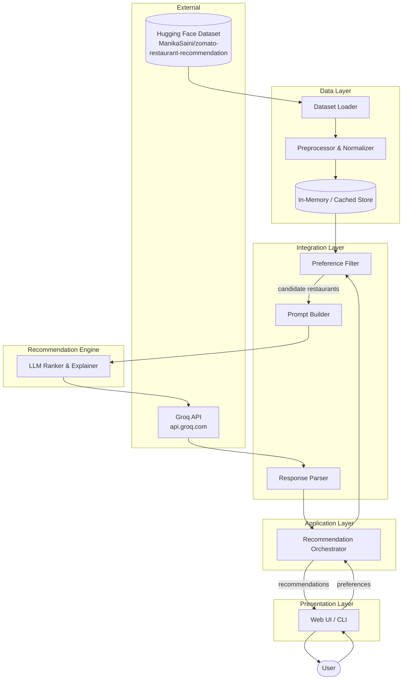
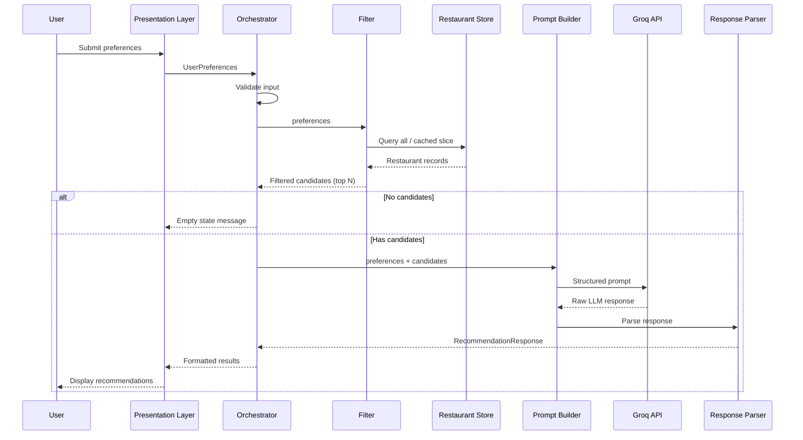
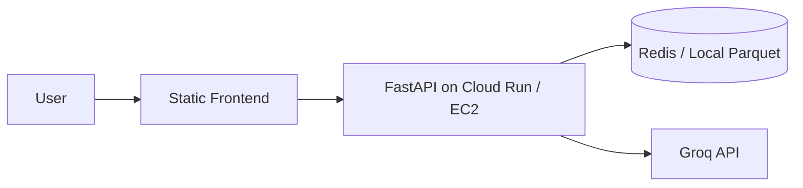

# System Architecture: AI-Powered Restaurant Recommendation System

This document describes the technical architecture for the Zomato-inspired restaurant recommendation service defined in [context.md](./context.md). The system combines structured restaurant data with **Groq** (LLM inference API) to deliver personalized, explainable recommendations with low latency.

---

## Table of Contents

1. [Architectural Overview](#architectural-overview)
2. [Design Principles](#design-principles)
3. [High-Level System Diagram](#high-level-system-diagram)
4. [Layered Architecture](#layered-architecture)
5. [Component Breakdown](#component-breakdown)
6. [Data Architecture](#data-architecture)
7. [Request Lifecycle](#request-lifecycle)
8. [Integration Layer Design](#integration-layer-design)
9. [Recommendation Engine (LLM) Design](#recommendation-engine-llm-design)
10. [Presentation Layer](#presentation-layer)
11. [Suggested Technology Stack](#suggested-technology-stack)
12. [Project Structure](#project-structure)
13. [API Contract (Reference)](#api-contract-reference)
14. [Non-Functional Requirements](#non-functional-requirements)
15. [Error Handling & Resilience](#error-handling--resilience)
16. [Security Considerations](#security-considerations)
17. [Deployment Architecture](#deployment-architecture)
18. [Future Extensions](#future-extensions)

---

## Architectural Overview

The application follows a **layered, pipeline-oriented architecture**:

```
┌─────────────────────────────────────────────────────────────────┐
│                     Presentation Layer (UI)                      │
│         Collect preferences · Display ranked results             │
└────────────────────────────┬────────────────────────────────────┘
                             │
┌────────────────────────────▼────────────────────────────────────┐
│                      Application Layer                           │
│    Orchestrates workflow: input → filter → LLM → format output   │
└────────────────────────────┬────────────────────────────────────┘
                             │
        ┌────────────────────┼────────────────────┐
        │                    │                    │
┌───────▼───────┐  ┌─────────▼─────────┐  ┌───────▼───────┐
│  Data Layer   │  │ Integration Layer │  │  LLM Layer    │
│  Ingestion &  │  │ Filter & prompt   │  │ Rank & explain│
│  preprocessing│  │ construction      │  │               │
└───────┬───────┘  └─────────┬─────────┘  └───────┬───────┘
        │                    │                    │
        └────────────────────┼────────────────────┘
                             │
              ┌──────────────▼──────────────┐
              │   External Data Source       │
              │   Hugging Face Dataset       │
              └─────────────────────────────┘
```

**Core idea:** Structured filtering narrows the candidate set *before* the LLM runs. The LLM then ranks, explains, and optionally summarizes a manageable subset—keeping latency and token cost under control while improving recommendation quality.

---

## Design Principles

| Principle | Rationale |
|-----------|-----------|
| **Filter first, reason second** | Apply deterministic filters on location, budget, cuisine, and rating before invoking the LLM. |
| **Structured in, structured out** | Pass clean JSON/tabular data to the LLM; parse structured responses where possible. |
| **Explainability by design** | Every recommendation includes an AI-generated rationale tied to user preferences. |
| **Separation of concerns** | Data ingestion, filtering, LLM calls, and UI are independent modules with clear interfaces. |
| **Graceful degradation** | If the LLM fails, fall back to rule-based ranking from filtered results. |
| **Single source of truth** | Restaurant data is loaded once, normalized, and reused across sessions (cached locally or in memory). |

---

## High-Level System Diagram



---

## Layered Architecture

### Layer 1: Data Layer

Responsible for acquiring, cleaning, and serving restaurant records.

| Module | Responsibility |
|--------|----------------|
| **Dataset Loader** | Fetch dataset from Hugging Face (`datasets` library or HTTP). |
| **Preprocessor** | Normalize field names, parse cuisines, map cost to budget tiers, handle missing values. |
| **Restaurant Store** | In-memory DataFrame, SQLite, or JSON cache for fast repeated queries. |

### Layer 2: Integration Layer

Bridges user preferences and the LLM.

| Module | Responsibility |
|--------|----------------|
| **Preference Filter** | Apply hard filters: location, cuisine, min rating, budget band. |
| **Candidate Selector** | Limit to top N candidates (e.g., 15–25) by pre-score before LLM. |
| **Prompt Builder** | Assemble system + user prompts with user prefs and candidate JSON. |
| **Response Parser** | Parse LLM output into typed recommendation objects; validate schema. |

### Layer 3: Recommendation Engine (LLM Layer)

| Module | Responsibility |
|--------|----------------|
| **Groq Client** | Call Groq Chat Completions API for ranking and explanation generation. |
| **Ranker** | Request ranked list with explanations. |
| **Summarizer** *(optional)* | Generate a brief overview of the recommendation set. |

### Layer 4: Application Layer

| Module | Responsibility |
|--------|----------------|
| **Orchestrator** | End-to-end workflow: validate input → filter → LLM → format response. |
| **Validator** | Validate user preferences (required fields, allowed values). |

### Layer 5: Presentation Layer

| Module | Responsibility |
|--------|----------------|
| **Input Form** | Collect location, budget, cuisine, min rating, free-text preferences. |
| **Results View** | Display ranked cards: name, cuisine, rating, cost, explanation. |
| **Loading / Error States** | UX for async LLM calls and failures. |

---

## Component Breakdown

### 1. Data Ingestion Pipeline

```
Hugging Face → Raw Records → Field Extraction → Normalization → Cached Store
```

**Extracted fields (minimum):**

| Field | Type | Notes |
|-------|------|-------|
| `restaurant_name` | string | Display name |
| `location` | string | City/area; normalize for case-insensitive match |
| `cuisine` | string / list | May be comma-separated; split and trim |
| `rating` | float | Minimum threshold filter |
| `cost` | string / int | Map to `low` / `medium` / `high` tiers |
| `address` | string | Optional display |
| `votes` | int | Optional tie-breaker for pre-ranking |

**Preprocessing steps:**

1. Drop or impute rows with missing critical fields (name, location).
2. Normalize location strings (trim, title case, alias mapping if needed).
3. Parse cuisine into a list for multi-cuisine matching.
4. Convert rating to numeric; clamp to valid range (e.g., 0–5).
5. Derive `budget_tier` from cost columns using configurable thresholds.
6. Deduplicate by restaurant name + location where applicable.

### 2. User Preference Model

```python
# Conceptual schema
UserPreferences:
    location: str              # required
    budget: Literal["low", "medium", "high"]  # required
    cuisine: str               # required
    min_rating: float          # required, e.g. 3.5
    additional_preferences: str | None  # free text, e.g. "family-friendly, quick service"
```

**Validation rules:**

- `location`: non-empty; match against known cities in dataset or fuzzy match.
- `budget`: enum constraint.
- `min_rating`: 0.0–5.0.
- `additional_preferences`: optional; passed verbatim to LLM for soft matching.

### 3. Preference Filter (Deterministic)

Filtering runs **before** the LLM to reduce noise and token usage.

| Filter | Logic |
|--------|-------|
| Location | Case-insensitive equality or contains match on city/area |
| Cuisine | Candidate cuisine list intersects requested cuisine |
| Min rating | `restaurant.rating >= min_rating` |
| Budget | `restaurant.budget_tier == user.budget` or within adjacent tier |

**Pre-ranking (optional):** Sort filtered candidates by rating desc, then votes desc. Take top **N** (recommended: 20) for the LLM context window.

### 4. Output Model

```python
# Conceptual schema
Recommendation:
    rank: int
    restaurant_name: str
    cuisine: str
    rating: float
    estimated_cost: str
    explanation: str           # AI-generated

RecommendationResponse:
    recommendations: list[Recommendation]
    summary: str | None        # optional LLM overview
    total_candidates_considered: int
```

---

## Data Architecture

### Source

| Attribute | Value |
|-----------|-------|
| Platform | Hugging Face |
| Dataset ID | `ManikaSaini/zomato-restaurant-recommendation` |
| URL | https://huggingface.co/datasets/ManikaSaini/zomato-restaurant-recommendation |

### Storage Strategy

| Approach | Use Case |
|----------|----------|
| **In-memory (pandas DataFrame)** | Prototype, single-process apps |
| **Local Parquet/JSON cache** | Avoid re-downloading on every startup |
| **SQLite** | Persistent local store, simple queries |

**Recommended flow:**

1. On first run: download from Hugging Face → preprocess → save to `data/processed/restaurants.parquet`.
2. On subsequent runs: load from cache if present and fresh.
3. Expose read-only query interface to the filter module.

### Budget Tier Mapping

Define configurable thresholds (adjust after inspecting dataset):

| Tier | Example Cost Range (INR for two) |
|------|----------------------------------|
| `low` | ≤ 500 |
| `medium` | 501 – 1500 |
| `high` | > 1500 |

*Exact mapping depends on dataset column semantics (e.g., "approx_cost(for two people)").*

---

## Request Lifecycle



**Steps:**

1. User submits preferences via UI.
2. Orchestrator validates input.
3. Filter queries store and applies hard filters.
4. If zero candidates → return helpful empty state (suggest relaxing filters).
5. Prompt builder creates LLM prompt with user prefs + candidate JSON.
6. LLM ranks and explains; parser validates structure.
7. Orchestrator merges LLM output with structured metadata.
8. UI renders recommendation cards.

---

## Integration Layer Design

### Responsibilities

1. **Translate** user preferences into filter predicates.
2. **Serialize** candidate restaurants into a compact JSON payload for the LLM.
3. **Construct** prompts that enforce consistent output format.
4. **Parse** LLM responses into application models.

### Prompt Structure

```
┌─────────────────────────────────────┐
│ System Prompt                        │
│ - Role: restaurant recommendation   │
│   assistant                          │
│ - Output format: JSON schema         │
│ - Constraints: only recommend from   │
│   provided list                      │
└─────────────────────────────────────┘
┌─────────────────────────────────────┐
│ User Prompt                          │
│ - User preferences (structured)      │
│ - Candidate restaurants (JSON array) │
│ - Task: rank top 5, explain each     │
└─────────────────────────────────────┘
```

### Example Prompt Contract

**System message (summary):**

> You are a restaurant recommendation assistant. Given user preferences and a list of restaurants, rank the best matches. Return valid JSON only. Do not invent restaurants not in the list.

**Expected LLM JSON output:**

```json
{
  "recommendations": [
    {
      "rank": 1,
      "restaurant_name": "Example Bistro",
      "explanation": "Matches your Italian preference in Bangalore with a 4.2 rating and medium budget."
    }
  ],
  "summary": "These options balance your cuisine and budget preferences in your chosen location."
}
```

The response parser enriches each item with `cuisine`, `rating`, and `estimated_cost` from the structured candidate data (LLM should not hallucinate these).

---

## Recommendation Engine (LLM) Design

### LLM Provider: Groq

This project uses **[Groq](https://groq.com/)** as the sole LLM provider. Groq exposes an OpenAI-compatible Chat Completions API with fast inference, which suits the interactive recommendation workflow.

| Attribute | Value |
|-----------|-------|
| **Provider** | Groq |
| **SDK** | `groq` (official Python client) |
| **API base URL** | `https://api.groq.com/openai/v1` |
| **Auth** | `GROQ_API_KEY` in environment / `.env` |
| **Recommended model** | `llama-3.3-70b-versatile` (ranking + explanations) |
| **Fallback model** | `llama-3.1-8b-instant` (lower latency, simpler prompts) |

### Groq Client

```
GroqClient
├── __init__(api_key, model)
├── generate_recommendations(system_prompt, user_prompt) -> str
└── generate_summary(recommendations) -> str   # optional
```

**Implementation notes:**

- Use the `groq` Python package (`Groq(api_key=...)`).
- Set `response_format={"type": "json_object"}` to enforce structured recommendation output.
- Configure `temperature` (e.g., `0.3`) for consistent ranking; increase slightly if explanations feel repetitive.
- Handle Groq-specific errors: rate limits (`429`), model unavailable, and request timeouts.

### Ranking Strategy

| Stage | Method |
|-------|--------|
| **Pre-filter** | Deterministic SQL/pandas filters |
| **Pre-rank** | Sort by rating, votes (optional) |
| **Final rank** | LLM considers soft preferences (family-friendly, quick service) |
| **Explain** | LLM generates per-item rationale referencing user inputs |

### Token & Cost Management

- Cap candidates sent to LLM (15–25 restaurants).
- Send only essential fields per candidate: name, cuisine, rating, cost, location.
- Use Groq JSON mode via `response_format={"type": "json_object"}` on chat completions.
- Set `max_tokens` appropriately for 5 recommendations + summary.

### Fallback Behavior

If the Groq API call fails (timeout, Groq rate limit, invalid JSON):

1. Log error.
2. Return top 5 pre-ranked filtered results.
3. Use template explanation: *"Recommended based on your filters: {cuisine} in {location}, rating ≥ {min_rating}."*
4. Surface a non-blocking warning in the UI.

---

## Presentation Layer

### UI Flow

```
Landing → Preference Form → [Submit] → Loading → Results → [New Search]
```

### Input Form Fields

| Field | Control Type | Required |
|-------|--------------|----------|
| Location | Dropdown or autocomplete | Yes |
| Budget | Radio: low / medium / high | Yes |
| Cuisine | Dropdown or text | Yes |
| Minimum rating | Slider or number input | Yes |
| Additional preferences | Textarea | No |

### Results Display

Each recommendation card shows:

- **Rank** (#1, #2, …)
- **Restaurant name**
- **Cuisine**
- **Rating** (with visual indicator, e.g., stars)
- **Estimated cost**
- **AI explanation** (highlighted block)

Optional: collapsible **summary** section at the top.

### UI Technology Options

| Option | Pros |
|--------|------|
| **Streamlit** | Fastest prototype; Python-only |
| **Gradio** | Simple ML demo UI |
| **React + FastAPI** | Production-ready, separable frontend/backend |
| **CLI** | Minimal dependency demo |

---

## Suggested Technology Stack

| Layer | Recommended | Alternatives |
|-------|-------------|--------------|
| Language | Python 3.10+ | — |
| Data loading | `datasets`, `pandas` | `polars` |
| Dataset source | Hugging Face `datasets` | Direct CSV download |
| Filtering | `pandas` queries | SQLAlchemy + SQLite |
| LLM | **Groq API** (`groq` SDK) | — |
| LLM model | `llama-3.3-70b-versatile` | `llama-3.1-8b-instant` |
| Backend API | FastAPI | Flask |
| Frontend | Streamlit (MVP) | React, Gradio |
| Config | `pydantic-settings`, `.env` (`GROQ_API_KEY`) | YAML config |
| Logging | `structlog` or `logging` | — |

---

## Project Structure

```
ZOMATORECOMproject/
├── docs/
│   ├── context.md
│   ├── architecture.md
│   └── problemstatement.txt
├── data/
│   └── processed/              # Cached preprocessed data
│       └── restaurants.parquet
├── src/
│   ├── __init__.py
│   ├── main.py                 # Entry point (CLI or app launcher)
│   ├── config.py               # Settings, env vars, budget thresholds
│   ├── models/
│   │   ├── preferences.py      # UserPreferences
│   │   └── recommendation.py   # Recommendation, RecommendationResponse
│   ├── data/
│   │   ├── loader.py           # Hugging Face download
│   │   ├── preprocessor.py     # Clean & normalize
│   │   └── store.py            # Cached data access
│   ├── services/
│   │   ├── filter.py           # Deterministic filtering
│   │   ├── orchestrator.py     # End-to-end workflow
│   │   └── recommender.py      # LLM ranking & explanation
│   ├── llm/
│   │   ├── client.py           # Groq API client
│   │   ├── prompts.py          # Prompt templates
│   │   └── parser.py           # Response parsing & validation
│   └── ui/
│       └── app.py              # Streamlit / Gradio / API routes
├── tests/
│   ├── test_filter.py
│   ├── test_preprocessor.py
│   └── test_parser.py
├── .env.example                # GROQ_API_KEY template
├── requirements.txt            # includes groq, datasets, pandas, etc.
└── README.md
```

---

## API Contract (Reference)

If exposing a REST API (e.g., FastAPI):

### `POST /recommendations`

**Request:**

```json
{
  "location": "Bangalore",
  "budget": "medium",
  "cuisine": "Italian",
  "min_rating": 4.0,
  "additional_preferences": "family-friendly, outdoor seating"
}
```

**Response (200):**

```json
{
  "recommendations": [
    {
      "rank": 1,
      "restaurant_name": "Truffles",
      "cuisine": "Italian, Continental",
      "rating": 4.5,
      "estimated_cost": "₹800 for two",
      "explanation": "Highly rated Italian option in Bangalore within your medium budget, suitable for families."
    }
  ],
  "summary": "Top Italian picks in Bangalore matching your rating and budget preferences.",
  "total_candidates_considered": 18
}
```

**Error responses:**

| Status | Condition |
|--------|-----------|
| 400 | Invalid preferences (validation failure) |
| 404 | No restaurants match filters |
| 502 | Groq API error (after fallback attempt) |
| 503 | Dataset not loaded |

---

## Non-Functional Requirements

| Requirement | Target |
|-------------|--------|
| **Latency** | Filter < 500 ms; end-to-end with LLM < 10 s |
| **Availability** | App usable when LLM is down (fallback mode) |
| **Scalability** | Single-user / demo scale; horizontal scaling optional via stateless API |
| **Maintainability** | Modular layers; Groq client isolated in `src/llm/` |
| **Observability** | Log filter counts, Groq latency, model ID, parse failures |

---

## Error Handling & Resilience

| Scenario | Handling |
|----------|----------|
| Dataset download fails | Retry with backoff; show clear error; use local cache if available |
| Empty filter results | Return message suggesting broader location, lower rating, or different cuisine |
| LLM timeout | Retry once; then fallback to rule-based top 5 |
| Invalid LLM JSON | Retry with repair prompt; then fallback |
| Missing `GROQ_API_KEY` | Fail fast at startup with configuration instructions |

---

## Security Considerations

| Area | Measure |
|------|---------|
| **API keys** | Store `GROQ_API_KEY` in `.env`; never commit secrets |
| **User input** | Sanitize free-text preferences before prompt injection |
| **Prompt injection** | Treat `additional_preferences` as untrusted; instruct LLM to ignore override attempts |
| **LLM output** | Validate against candidate list; reject hallucinated restaurant names |
| **Rate limiting** | Apply on API endpoints if deployed publicly |

---

## Deployment Architecture

### Local / Development

```
Developer Machine
├── Python venv
├── Cached dataset (data/processed/)
├── GROQ_API_KEY in .env
└── Streamlit / uvicorn on localhost
```

### Production (Optional)



- Containerize with Docker.
- Pre-bake processed dataset into image or mount volume.
- Use secrets manager for `GROQ_API_KEY`.
- Enable HTTPS at reverse proxy (nginx / cloud load balancer).

---

## Future Extensions

| Extension | Description |
|-----------|-------------|
| **User accounts & history** | Persist past searches and refine recommendations |
| **Geolocation** | Map-based search with distance filtering |
| **Embeddings + RAG** | Semantic search over reviews/descriptions |
| **Model tuning on Groq** | Compare Groq models (e.g., 70B vs 8B) for quality vs latency |
| **Feedback loop** | Thumbs up/down to improve future prompts |
| **Real-time data** | Integrate live Zomato API instead of static dataset |

---

## Alignment with Success Criteria

| Success Criterion (from context.md) | Architectural Support |
|-------------------------------------|------------------------|
| Accept meaningful user preferences | `UserPreferences` model + validation in orchestrator |
| Filter real restaurant data | Deterministic filter layer on Hugging Face dataset |
| LLM ranked, explained recommendations | Groq-powered recommendation engine with structured prompts + parser |
| Clear result display | Presentation layer with typed `Recommendation` cards |

---

## Summary

The system is architected as a **five-stage pipeline**: ingest Zomato data from Hugging Face, collect user preferences, filter candidates deterministically, pass a bounded set to **Groq** for ranking and explanation, and render structured results. Clear module boundaries, a dedicated Groq client in `src/llm/`, and fallback paths ensure the application remains reliable, explainable, and aligned with the objectives defined in [context.md](./context.md).
