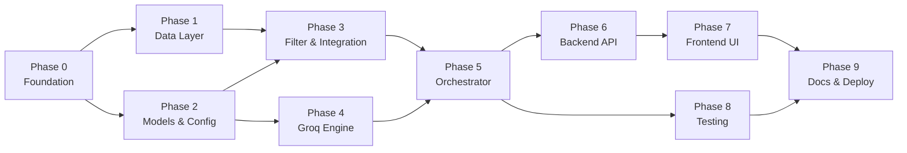
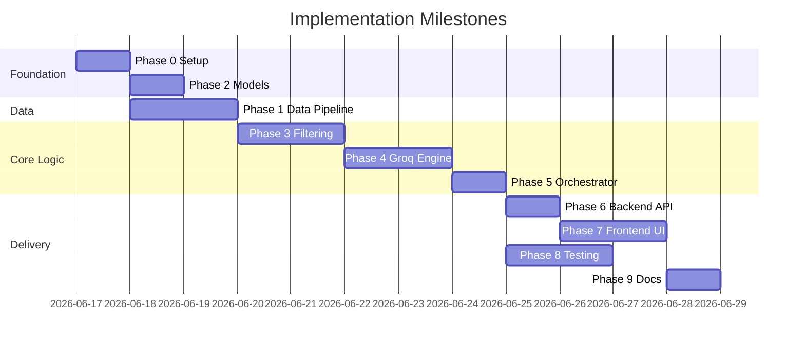

# Phase-Wise Implementation Plan

This document defines a step-by-step implementation roadmap for the AI-powered restaurant recommendation system. It is derived from [context.md](./context.md) and [architecture.md](./architecture.md).

---

## Table of Contents

1. [Overview](#overview)
2. [Implementation Phases at a Glance](#implementation-phases-at-a-glance)
3. [Phase Dependency Map](#phase-dependency-map)
4. [Phase 0: Project Foundation](#phase-0-project-foundation)
5. [Phase 1: Data Ingestion & Preprocessing](#phase-1-data-ingestion--preprocessing)
6. [Phase 2: Domain Models & Configuration](#phase-2-domain-models--configuration)
7. [Phase 3: Filtering & Integration Layer](#phase-3-filtering--integration-layer)
8. [Phase 4: Groq Recommendation Engine](#phase-4-groq-recommendation-engine)
9. [Phase 5: Application Orchestrator](#phase-5-application-orchestrator)
10. [Phase 6: Presentation Layer (UI)](#phase-6-presentation-layer-ui)
11. [Phase 7: Testing, Resilience & Hardening](#phase-7-testing-resilience--hardening)
12. [Phase 8: Documentation & Optional Deployment](#phase-8-documentation--optional-deployment)
13. [Success Criteria Checklist](#success-criteria-checklist)
14. [Risk Register](#risk-register)

---

## Overview

### Goal

Build an end-to-end application that:

1. Loads and preprocesses the Zomato dataset from Hugging Face
2. Collects user preferences (location, budget, cuisine, rating, extras)
3. Filters candidates deterministically before LLM processing
4. Uses **Groq** to rank restaurants and generate explanations
5. Displays results in a clear, user-friendly UI

### Guiding Principles (from architecture)

- **Filter first, reason second** — hard filters before Groq
- **Structured in, structured out** — JSON prompts and parsed responses
- **Graceful degradation** — fallback ranking if Groq fails
- **Separation of concerns** — one module per layer

### Recommended Stack

| Layer | Choice |
|-------|--------|
| Language | Python 3.10+ |
| Data | `datasets`, `pandas` |
| LLM | Groq (`groq` SDK, `llama-3.3-70b-versatile`) |
| UI | Streamlit (MVP) |
| Config | `pydantic-settings`, `.env` |

---

## Implementation Phases at a Glance

| Phase | Name | Primary Deliverable | Est. Duration |
|-------|------|---------------------|---------------|
| **0** | Project Foundation | Repo scaffold, dependencies, config | 0.5–1 day |
| **1** | Data Ingestion & Preprocessing | Cached restaurant dataset ready for queries | 1–2 days |
| **2** | Domain Models & Configuration | Typed models + settings | 0.5–1 day |
| **3** | Filtering & Integration Layer | Deterministic filter + prompt builder | 1–2 days |
| **4** | Groq Recommendation Engine | LLM client, prompts, parser | 1–2 days |
| **5** | Application Orchestrator | End-to-end recommendation pipeline | 1 day |
| **6** | Backend API Layer (FastAPI) | FastAPI endpoints and CORS setup | 1 day |
| **7** | Premium Frontend Layer (UI) | React + Vite app with Vanilla CSS | 1–2 days |
| **8** | Testing, Resilience & Hardening | Tests, fallbacks, error UX | 1–2 days |
| **9** | Documentation & Optional Deployment | README, `.env.example`, Docker (optional) | 0.5–1 day |

**Total estimated effort:** 8–15 days (single developer, MVP scope)

---

## Phase Dependency Map



---

## Phase 0: Project Foundation

**Objective:** Establish project structure, dependencies, and environment so later phases can proceed without rework.

### Tasks

| # | Task | Details |
|---|------|---------|
| 0.1 | Create directory structure | Match [architecture.md](./architecture.md) project layout: `src/`, `data/processed/`, `tests/`, `docs/` |
| 0.2 | Initialize Python package | Add `src/__init__.py` and subpackage `__init__.py` files |
| 0.3 | Create `requirements.txt` | Pin: `groq`, `datasets`, `pandas`, `pydantic`, `pydantic-settings`, `python-dotenv`, `streamlit`, `pytest` |
| 0.4 | Create `.env.example` | Document `GROQ_API_KEY`, model name, budget thresholds, candidate cap |
| 0.5 | Add `.gitignore` | Exclude `.env`, `data/processed/`, `__pycache__/`, `.venv/` |
| 0.6 | Create virtual environment | `python -m venv .venv` and install dependencies |
| 0.7 | Stub `src/main.py` | Minimal entry point placeholder |

### Files to Create

```
ZOMATORECOMproject/
├── .env.example
├── .gitignore
├── requirements.txt
├── src/
│   ├── __init__.py
│   ├── main.py
│   ├── config.py          # stub
│   ├── models/
│   ├── data/
│   ├── services/
│   ├── llm/
│   └── ui/
└── tests/
```

### Acceptance Criteria

- [ ] Virtual environment installs all dependencies without errors
- [ ] Project imports resolve (`python -c "import src"`)
- [ ] `.env.example` documents required variables
- [ ] Directory layout matches architecture spec

### Blocks

Nothing — this is the starting phase.

---

## Phase 1: Data Ingestion & Preprocessing

**Objective:** Download the Hugging Face dataset, clean it, and cache it for fast reuse.

**Maps to context workflow:** *Data Ingestion*

### Tasks

| # | Task | Details |
|---|------|---------|
| 1.1 | Implement `src/data/loader.py` | Load `ManikaSaini/zomato-restaurant-recommendation` via `datasets.load_dataset()` |
| 1.2 | Inspect raw schema | Log column names; map to internal field names |
| 1.3 | Implement `src/data/preprocessor.py` | Normalize location, parse cuisine lists, convert rating to float, derive `budget_tier` |
| 1.4 | Handle missing data | Drop rows missing `restaurant_name` or `location`; handle invalid ratings |
| 1.5 | Budget tier mapping | Apply thresholds: low ≤ 500, medium 501–1500, high > 1500 INR (adjust after inspection) |
| 1.6 | Deduplicate records | By restaurant name + location |
| 1.7 | Implement `src/data/store.py` | Save/load `data/processed/restaurants.parquet`; load from cache on subsequent runs |
| 1.8 | Add cache-first logic | Download only if cache missing or forced refresh |

### Extracted Fields (minimum)

| Field | Source / Notes |
|-------|----------------|
| `restaurant_name` | Required |
| `location` | Normalized, title case |
| `cuisine` | Comma-separated → list |
| `rating` | Float, 0–5 |
| `cost` / `estimated_cost` | Raw + display string |
| `budget_tier` | Derived: `low` / `medium` / `high` |
| `votes` | Optional tie-breaker |
| `address` | Optional display |

### Acceptance Criteria

- [ ] Dataset downloads successfully from Hugging Face
- [ ] Preprocessed DataFrame has all required columns
- [ ] Parquet cache written to `data/processed/restaurants.parquet`
- [ ] Second run loads from cache (no re-download)
- [ ] Sample query returns restaurants for a known city (e.g., Bangalore)

### Depends On

Phase 0

### Test Targets

- `tests/test_preprocessor.py` — normalization, budget tiers, cuisine parsing

---

## Phase 2: Domain Models & Configuration

**Objective:** Define typed data models and centralized configuration used across all layers.

### Tasks

| # | Task | Details |
|---|------|---------|
| 2.1 | Implement `src/config.py` | `pydantic-settings` class: `GROQ_API_KEY`, model, fallback model, budget thresholds, `MAX_CANDIDATES` (20), `TOP_N` (5) |
| 2.2 | Implement `src/models/preferences.py` | `UserPreferences` with validation (location, budget enum, cuisine, min_rating 0–5, optional additional_preferences) |
| 2.3 | Implement `src/models/recommendation.py` | `Recommendation`, `RecommendationResponse` (with optional `summary`, `total_candidates_considered`, `fallback_used` flag) |
| 2.4 | Add helper enums | `BudgetTier = Literal["low", "medium", "high"]` |
| 2.5 | Fail-fast on missing key | Raise clear error if `GROQ_API_KEY` missing when LLM modules load |

### Model Schemas (reference)

```python
UserPreferences:
    location: str
    budget: Literal["low", "medium", "high"]
    cuisine: str
    min_rating: float
    additional_preferences: str | None = None

Recommendation:
    rank: int
    restaurant_name: str
    cuisine: str
    rating: float
    estimated_cost: str
    explanation: str

RecommendationResponse:
    recommendations: list[Recommendation]
    summary: str | None
    total_candidates_considered: int
    fallback_used: bool = False
```

### Acceptance Criteria

- [ ] Invalid preferences raise validation errors (bad budget, rating out of range)
- [ ] Config loads from `.env` correctly
- [ ] Models serialize to/from dict for API and prompts

### Depends On

Phase 0

---

## Phase 3: Filtering & Integration Layer

**Objective:** Filter restaurants by user preferences and prepare structured input for Groq.

**Maps to context workflow:** *Integration Layer*

### Tasks

| # | Task | Details |
|---|------|---------|
| 3.1 | Implement `src/services/filter.py` | Apply filters: location, cuisine, min_rating, budget |
| 3.2 | Location matching | Case-insensitive contains or equality on city |
| 3.3 | Cuisine matching | Intersect user cuisine with restaurant cuisine list |
| 3.4 | Pre-ranking | Sort by rating desc, then votes desc; cap at `MAX_CANDIDATES` (20) |
| 3.5 | Empty result handling | Return empty list with metadata for helpful UI message |
| 3.6 | Implement `src/llm/prompts.py` | System + user prompt templates with JSON output instructions |
| 3.7 | Candidate serialization | Compact JSON: name, cuisine, rating, cost, location only |
| 3.8 | Prompt constraints | Instruct Groq to only recommend from provided list; no hallucination |

### Filter Logic

| Filter | Rule |
|--------|------|
| Location | Case-insensitive match on city/area |
| Cuisine | Restaurant cuisines contain requested cuisine |
| Min rating | `rating >= min_rating` |
| Budget | `budget_tier == user.budget` (or adjacent tier if too few results) |

### Acceptance Criteria

- [ ] Filter returns correct subset for sample preferences (Bangalore + Italian + medium + 4.0)
- [ ] Pre-ranking limits output to configured max candidates
- [ ] Prompt includes user preferences + candidate JSON
- [ ] Prompt explicitly requires JSON-only output

### Depends On

Phases 1, 2

### Test Targets

- `tests/test_filter.py` — each filter dimension, empty results, pre-rank cap

---

## Phase 4: Groq Recommendation Engine

**Objective:** Integrate Groq for ranking, explanation, and optional summary generation.

**Maps to context workflow:** *Recommendation Engine*

### Tasks

| # | Task | Details |
|---|------|---------|
| 4.1 | Implement `src/llm/client.py` | `GroqClient` using official `groq` SDK |
| 4.2 | Configure chat completions | Model: `llama-3.3-70b-versatile`; `response_format={"type": "json_object"}`; `temperature=0.3` |
| 4.3 | Implement `generate_recommendations()` | Accept system + user prompts; return raw JSON string |
| 4.4 | Implement `src/llm/parser.py` | Parse JSON; validate schema; enrich with cuisine/rating/cost from candidates |
| 4.5 | Hallucination guard | Reject recommendations whose `restaurant_name` is not in candidate list |
| 4.6 | Implement `src/services/recommender.py` | Wire prompts → Groq client → parser → `RecommendationResponse` |
| 4.7 | Optional summary | Include `summary` field in Groq JSON output |
| 4.8 | Error handling | Catch `429`, timeouts, invalid JSON; support one retry |

### Groq Configuration

| Setting | Value |
|---------|-------|
| Provider | Groq |
| SDK | `groq` |
| API URL | `https://api.groq.com/openai/v1` |
| Auth | `GROQ_API_KEY` |
| Primary model | `llama-3.3-70b-versatile` |
| Fallback model | `llama-3.1-8b-instant` |

### Expected Groq Output Shape

```json
{
  "recommendations": [
    {
      "rank": 1,
      "restaurant_name": "Example Bistro",
      "explanation": "Matches your Italian preference..."
    }
  ],
  "summary": "Top picks for your criteria."
}
```

### Acceptance Criteria

- [ ] Groq client returns valid JSON for a sample prompt
- [ ] Parser produces typed `RecommendationResponse`
- [ ] Metadata (cuisine, rating, cost) merged from candidate data, not LLM
- [ ] Hallucinated restaurant names are filtered out
- [ ] Rate limit / timeout triggers retry or raises for fallback layer

### Depends On

Phases 2, 3

### Test Targets

- `tests/test_parser.py` — valid JSON, invalid JSON, hallucination rejection (mock Groq responses)

---

## Phase 5: Application Orchestrator

**Objective:** Connect all layers into a single end-to-end recommendation workflow.

**Maps to context workflow:** Full pipeline orchestration

### Tasks

| # | Task | Details |
|---|------|---------|
| 5.1 | Implement `src/services/orchestrator.py` | `get_recommendations(preferences) -> RecommendationResponse` |
| 5.2 | Input validation | Validate `UserPreferences` before filtering |
| 5.3 | Pipeline steps | validate → filter → (empty check) → recommender → response |
| 5.4 | Empty state | Return structured response with zero recommendations + user guidance message |
| 5.5 | Fallback path | On Groq failure: top 5 pre-ranked results + template explanations |
| 5.6 | Set `fallback_used=True` | When fallback path is taken |
| 5.7 | Logging | Log filter count, Groq latency, model ID, parse failures |
| 5.8 | Wire `src/main.py` | CLI or script to invoke orchestrator with sample preferences |

### Orchestrator Flow

```
UserPreferences
    → validate
    → filter (store)
    → if empty: return empty response
    → recommender (Groq)
    → on failure: fallback ranking
    → RecommendationResponse
```

### Acceptance Criteria

- [ ] End-to-end call returns recommendations for valid sample input
- [ ] Empty filter results return helpful message (no Groq call)
- [ ] Groq failure returns fallback top 5 with template explanations
- [ ] `total_candidates_considered` reflects filtered count
- [ ] CLI/script runs without UI

### Depends On

Phases 1, 3, 4

---

## Phase 6: Backend API Layer (FastAPI)

**Objective:** Expose the recommendation orchestrator as a REST API.

**Maps to context workflow:** *API Exposure*

### Tasks

| # | Task | Details |
|---|------|---------|
| 6.1 | Install FastAPI dependencies | Add `fastapi` and `uvicorn` to `requirements.txt` |
| 6.2 | Implement `src/api/main.py` | Create FastAPI app instance, configure CORS to allow frontend requests |
| 6.3 | Implement POST `/recommendations` | Endpoint receiving `UserPreferences` and returning `RecommendationResponse` |
| 6.4 | Error handling mapping | Map domain exceptions to appropriate HTTP 4xx/5xx responses |
| 6.5 | Wire `src/main.py` | Add `--serve` flag to launch `uvicorn src.api.main:app --reload` |

### Acceptance Criteria

- [ ] FastAPI server starts successfully
- [ ] POST `/recommendations` returns correctly formatted JSON recommendations
- [ ] CORS allows cross-origin requests from the frontend development server
- [ ] App runs via `python -m src.main --serve`

### Depends On

Phase 5

---

## Phase 7: Premium Frontend Layer (UI)

**Objective:** Build a high-quality React + Vite UI to collect preferences and display ranked recommendations.

**Maps to context workflow:** *User Input* + *Output Display*

### Tasks

| # | Task | Details |
|---|------|---------|
| 7.1 | Initialize React + Vite project | `npx create-vite@latest frontend --template react-ts` |
| 7.2 | Setup Design System | Create `frontend/src/index.css` with Vanilla CSS variables (colors, typography, spacing) |
| 7.3 | Preference form | Components for Location, Budget, Cuisine, Min Rating, and Additional Preferences |
| 7.4 | Submit handler | Fetch data from FastAPI; manage loading state and show micro-animations |
| 7.5 | Results cards | Premium design displaying rank, name, cuisine, rating, cost, and AI explanation |
| 7.6 | Summary section | Collapsible/stylized optional summary from Groq |
| 7.7 | Empty/Error state UX | Premium fallback UI with suggestions for relaxing filters |

### UI Fields

| Field | Control | Required |
|-------|---------|----------|
| Location | Input | Yes |
| Budget | Radio: low / medium / high | Yes |
| Cuisine | Input | Yes |
| Minimum rating | Number input/Slider (0–5) | Yes |
| Additional preferences | Textarea | No |

### Acceptance Criteria

- [ ] Premium, dynamic design aesthetics using Vanilla CSS without basic defaults
- [ ] User can submit preferences and see top recommendations
- [ ] Loading micro-animations shown during API request
- [ ] All output fields visible per recommendation
- [ ] Empty and fallback states handled gracefully

### Depends On

Phase 6

---

## Phase 8: Testing, Resilience & Hardening

**Objective:** Add automated tests, strengthen error handling, and meet non-functional targets.

### Tasks

| # | Task | Details |
|---|------|---------|
| 8.1 | Unit tests — preprocessor | Normalization, budget tiers, missing data |
| 8.2 | Unit tests — filter | Each filter, pre-rank cap, empty results |
| 8.3 | Unit tests — parser | Valid/invalid JSON, hallucination guard |
| 8.4 | Integration test | Orchestrator with mocked Groq client |
| 8.5 | Retry logic | One retry on Groq timeout / invalid JSON |
| 8.6 | Dataset download resilience | Retry with backoff; use cache on failure |
| 8.7 | Prompt injection mitigation | Sanitize `additional_preferences`; system prompt guardrails |
| 8.8 | Performance check | Filter < 500 ms; end-to-end with Groq < 10 s |
| 8.9 | Logging review | Ensure filter counts and Groq latency logged |

### Non-Functional Targets

| Requirement | Target |
|-------------|--------|
| Filter latency | < 500 ms |
| End-to-end (with Groq) | < 10 s |
| Availability | Usable when Groq is down (fallback mode) |

### Acceptance Criteria

- [ ] `pytest` passes all unit and integration tests
- [ ] Fallback path verified with simulated Groq failure
- [ ] No secrets in code or committed files
- [ ] Latency targets met on sample hardware

### Depends On

Phases 1–6

---

## Phase 9: Documentation & Optional Deployment

**Objective:** Finalize developer docs and optionally containerize for deployment.

### Tasks

| # | Task | Details |
|---|------|---------|
| 9.1 | Write `README.md` | Project overview, setup, env vars, run instructions |
| 9.2 | Document run commands | Data refresh, Backend launch, Frontend launch |
| 9.3 | Verify `.env.example` | Complete with `GROQ_API_KEY`, model settings |
| 9.4 | Optional: `Dockerfile` | Python image, install deps, pre-process or mount data volume |
| 8.5 | Optional: FastAPI layer | `POST /recommendations` per architecture API contract |
| 8.6 | Optional: docker-compose | Local run with env file |

### README Sections

1. Project description
2. Prerequisites (Python 3.10+, Groq API key)
3. Installation steps
4. Environment configuration
5. Running the app
6. Running tests
7. Architecture link to `docs/architecture.md`

### Acceptance Criteria

- [ ] New developer can set up and run app from README alone
- [ ] All docs in `docs/` cross-reference correctly
- [ ] (Optional) Docker image builds and runs

### Depends On

Phases 7, 8

---

## Success Criteria Checklist

Aligned with [context.md](./context.md):

| Criterion | Phase(s) | Verification |
|-----------|----------|--------------|
| Accept meaningful user preferences | 2, 7 | Form validation + model tests |
| Filter real restaurant data | 1, 3 | Filter tests + sample queries |
| LLM ranked, explained recommendations | 4, 5 | Groq integration + orchestrator E2E |
| Clear result display | 7 | UI shows name, cuisine, rating, cost, explanation |

---

## Risk Register

| Risk | Impact | Mitigation | Phase |
|------|--------|------------|-------|
| Dataset schema differs from assumptions | High | Inspect raw data early in Phase 1; adjust field mapping | 1 |
| Groq rate limits (`429`) | Medium | Cap candidates; retry once; fallback ranking | 4, 5, 7 |
| Cost column format inconsistent | Medium | Flexible parsing in preprocessor; manual threshold tuning | 1 |
| Hallucinated restaurant names | High | Parser validates against candidate list | 4 |
| Too few results after strict filters | Medium | Relax budget to adjacent tier; suggest broader filters in UI | 3, 7 |
| Missing `GROQ_API_KEY` | Low | Fail fast at startup with clear message | 2 |
| Slow first run (dataset download) | Low | Parquet cache; document expected wait | 1 |

---

## Suggested Execution Order (Weekly Plan)

### Week 1 — Core Backend

| Day | Phases | Focus |
|-----|--------|-------|
| Day 1 | 0, 2 | Scaffold, config, models |
| Day 2–3 | 1 | Data loader, preprocessor, cache |
| Day 4 | 3 | Filter + prompt builder |
| Day 5 | 4 | Groq client, parser, recommender |

### Week 2 — Integration & Polish

| Day | Phases | Focus |
|-----|--------|-------|
| Day 1 | 5 | Orchestrator + CLI |
| Day 2 | 6 | Backend API (FastAPI) |
| Day 3-4 | 7 | React + Vite UI |
| Day 5 | 8, 9 | Tests, fallbacks, docs |

---

## Milestone Summary



---

## Quick Start After All Phases

```bash
# 1. Setup
python -m venv .venv
.venv\Scripts\activate          # Windows
pip install -r requirements.txt
copy .env.example .env          # Add GROQ_API_KEY

# 2. Preprocess dataset (first run)
python -m src.main --prepare-data

# 3. Run Backend API
python -m src.main --serve

# 4. Run Frontend UI (in a separate terminal)
cd frontend
npm install
npm run dev

# 4. Run tests
pytest tests/ -v
```

---

## Related Documents

- [context.md](./context.md) — Project objectives and workflow
- [architecture.md](./architecture.md) — System design, Groq integration, API contract
- [problemstatement.txt](./problemstatement.txt) — Original problem statement
